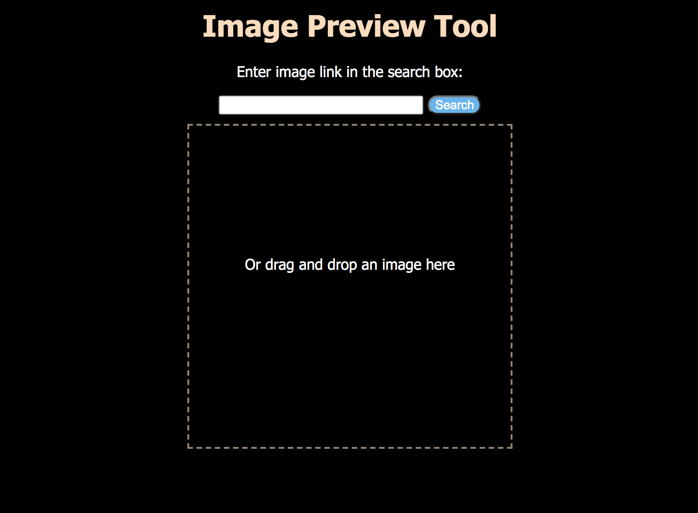
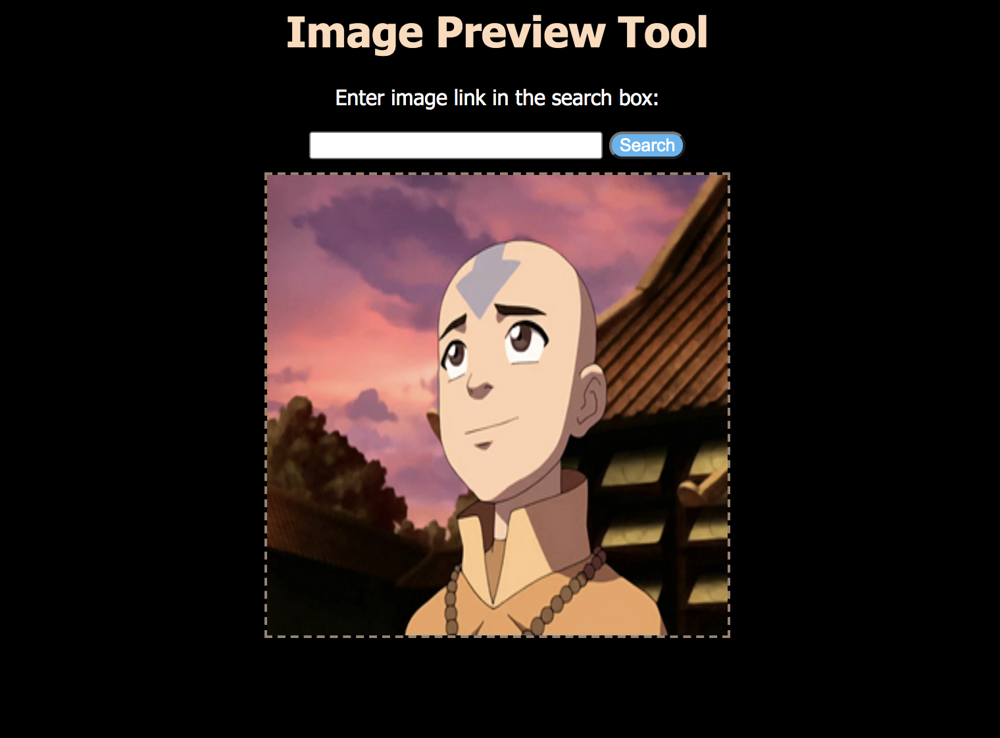

# Image-Preview-Tool
This website allows a user to preview an image in either of two ways:
1. inputting a URL into the search box
2. dragging and dropping an image from the computer
It can simulate a part of a process that requires uploading an image and
checking to see how it will look when uploaded.

## To run
Double-click `index.html` to display it in your browser

## Example

